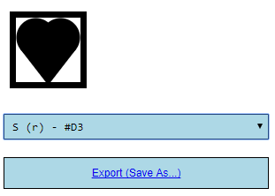

# C64Symbols

## Synopsis

A simple [angular](https://angular.io/) App for rendering and exporting C64 Symbols as svg. C64 Symbols being the ones printed on the KeyCaps. They can be referenced by [PETSCII codes](http://sta.c64.org/cbm64pet.html).

For making handling svg the biggest pleasure possible the [best JavaScript Library ever created](https://d3js.org/) was utilized. For usage in combination with angular [d3-ng2-service](https://github.com/tomwanzek/d3-ng2-service) was used.

## Installation & Running the App

1. Clone this
2. Install [angular cli](https://github.com/angular/angular-cli)
3. npm install
4. ng serve
5. [http://localhost:4200](http://localhost:4200)

## Sample

